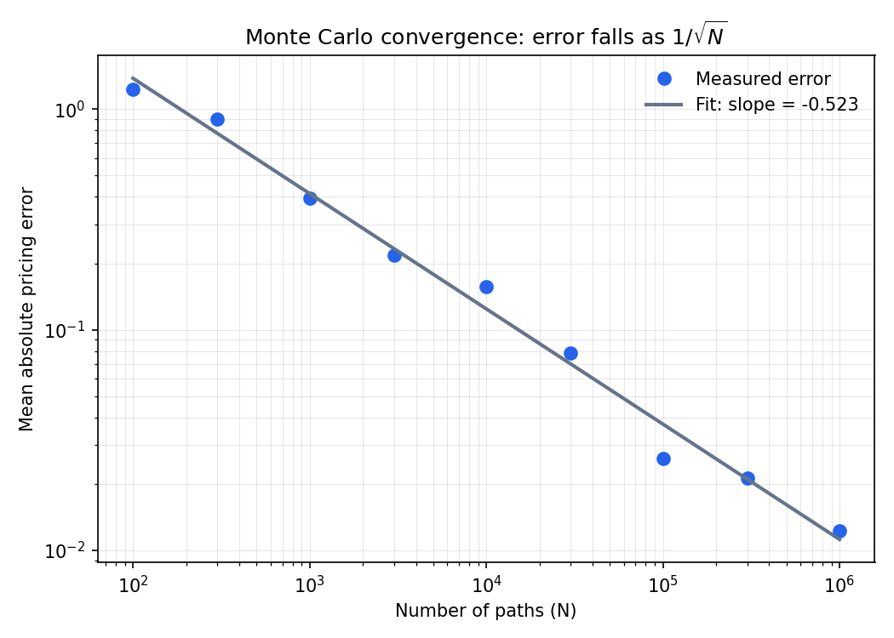

# Options Pricing Engine

Three ways of pricing the same option, built from scratch and used to check each other.

I'm a first-year CS student learning how derivatives pricing works. 

---

# 1. Introduction

## What an option is

I sell you, for $20 today, the **right** to buy a concert ticket from me at $100 on
June 1st. Not the obligation.

- If the artist blows up and tickets resell at $300, you use the right, pay me $100, and
  you're ahead.
- If the artist flops and tickets go for $40, you walk away and lose only the $20.

That contract is an option. The $20 is the **premium**, and computing it is what this
repo does. The $100 is the **strike**, and June 1st is the **expiry**.

**European** options can only be used *on* the expiry date. **American** options can be
used any time up to it. Because more choice can never hurt you, an American option is
always worth at least as much as the European equivalent — a gap called the
*early-exercise premium*, which this repo measures and one test asserts.

Five inputs determine the price:

| Input | In the analogy | Can you look it up? |
|---|---|---|
| S — spot price | what tickets go for now | yes |
| K — strike | the agreed $100 | yes |
| T — time to expiry | months until June 1st | yes |
| r — risk-free rate | what cash earns meanwhile | yes |
| **sigma — volatility** | **how wildly popularity swings** | **no** |

Four of the five are observable. Volatility is not, because nobody knows how much the
artist's popularity will swing between now and June. **That single unobservable input is
the whole difficulty of the field**, and every model here is ultimately a different way of
turning a guess about sigma into a price.

## Why options need pricing at all

Quant firms are mostly **market makers**. Rather than betting on direction, they quote a
price to buy and a price to sell at the same time, continuously, and earn the **spread**
between them thousands of times a day. Because that spread is thin, a pricing error wider
than the spread wipes out the entire margin. The value of the firm is therefore in being
able to quote a price that is *right*, fast, every time — not in predicting anything.

They also don't want the directional risk that comes with the contracts they sell. When a
market maker sells you that ticket-right, she immediately buys a calculated fraction of
actual tickets. That fraction is **delta**, the sensitivity of the option's price to the
underlying price. If the artist blows up she loses on the option but wins on the tickets;
if it flops, the reverse. Direction cancels out, and the spread remains. This is **delta
hedging**, and it is why accurate pricing matters more than accurate forecasting.

Two framings that helped me place this:

- **It's insurance.** An option is a *contingent claim*: an uncertain future payout. You
  price it by finding the probability distribution of that payout and discounting its
  expectation back to today. That is structurally the same as actuarial pricing, which is
  what I was studying before this — the premium is a policy premium, and sigma plays the
  role of claim variance.
- **It's poker.** Nobody is forecasting. It's a large number of small positive-EV bets,
  sized so no single one is ruinous, with the law of large numbers doing the work.
  Hedging is the extra step that strips out even the luck of the draw.

---

# 2. The three models

All three answer the same question:

> **price = e^(-rT) × E[payoff at expiry]**

the expected payoff, discounted to today. They differ only in how they evaluate that
expectation — and it's worth being clear up front that **they are three computations of
the same model**, not three competing theories.

## 2.1 Black-Scholes — solve the integral

**The idea.** Assume the stock follows geometric Brownian motion,
`dS = mu*S*dt + sigma*S*dW`. The `S` multiplying both terms makes the moves
*proportional* rather than absolute, so a 2% day is a 2% day whether the stock is at $10
or $1,000, and the price can never go negative.

**The maths.** Applying **Ito's lemma** to ln(S) turns the equation into one with constant
coefficients, which integrates directly:

    S_T = S_0 * exp((mu - sigma^2/2)*T + sigma*sqrt(T)*Z),   Z ~ N(0,1)

The `-sigma^2/2` is **Ito's correction**. It appears because exp() is convex, so
E[exp(X)] != exp(E[X]) — without it the simulated stock would drift faster than intended.

Then comes **risk-neutral pricing**. Because the option's payoff can be replicated by
continuously trading the stock and cash, its price cannot depend on anyone's view of where
the stock is headed. So we set mu = r - q and price as though nobody cared about risk.
**The option's value depends on how much the stock moves, not which way** — which is
exactly why a market maker can quote options without a directional opinion.

S_T is then log-normal, the expectation has a closed form, and:

    Call = S*e^(-qT)*N(d1) - K*e^(-rT)*N(d2)
    d1 = [ln(S/K) + (r - q + sigma^2/2)T] / (sigma*sqrt(T))
    d2 = d1 - sigma*sqrt(T)

Reading it: N(d2) is the risk-neutral probability of finishing in the money, so
K*e^(-rT)*N(d2) is the expected discounted cost of paying the strike, and
S*e^(-qT)*N(d1) the expected discounted value of what you receive. What you get minus
what you pay, each weighted by probability.

**Assumptions:** constant volatility; log-normal returns; continuous, costless trading
(needed for the replication argument); a known constant interest rate; European exercise
only.

**Limitations:** it has nowhere to represent a decision made partway through, so it cannot
price American options at all. And a single sigma cannot reprice a whole option chain,
because real markets show different implied volatilities at different strikes.

## 2.2 Binomial tree (Cox-Ross-Rubinstein) — enumerate

**The idea.** Chop time into N steps. At each step the stock either multiplies by `u` or
by `d`. Map out every branch, compute the payoff at every ending, then work backwards.

**The maths.**

    dt = T / N
    u  = exp(sigma*sqrt(dt))
    d  = 1 / u
    p  = (exp((r - q)*dt) - d) / (u - d)

`p` is again a **risk-neutral** probability, not a real-world one: it is the value that
makes the stock drift at the risk-free rate. Terminal values are the payoffs, and each
earlier node is the discounted expected value of the two nodes it leads to:

    V = e^(-r*dt) * (p*V_up + (1-p)*V_down)

**American options fall out naturally**, because at every node you can simply compare:

    value = max(continuation, intrinsic)

There is nowhere in a formula to put that comparison — it is a decision at every point in
time — which is precisely why the tree exists.

**Assumptions:** the same GBM story and constant volatility as Black-Scholes, plus the
additional one that time moves in discrete steps.

**Limitations:** error is O(1/N), so it's an approximation that only improves with steps.
It handles path-dependence badly (the tree tracks where you are, not how you got there)
and scales poorly to multiple assets.

## 2.3 Monte Carlo — sample

**The idea.** Instead of enumerating every future, draw a large random sample of them.
Compute the payoff in each, average, discount.

**The maths.** Draw Z ~ N(0,1), push each through the same GBM solution, then:

    price = e^(-rT) * mean( max(S_T - K, 0) )

The **law of large numbers** guarantees this converges to the true expectation. The
**central limit theorem** tells you how fast: the standard error of a sample mean is
`sd/sqrt(n)`. That is the entire source of the 1/sqrt(N) rate — it is a property of
averaging, not of options, and you'd meet the same exponent estimating average height.

**Assumptions:** whatever model you choose to simulate (here, the same GBM), plus the
practical one that your random number generator is sound and your sample is large enough.

**Limitations:** slow, and it carries **sampling error** that the closed form does not.
Early exercise is awkward, because deciding whether to exercise requires knowing the
continuation value, which is exactly what you're trying to estimate.

## 2.4 Why all three are necessary

**They have different reach.** Each one is the only method that works somewhere:

| | Black-Scholes | Binomial | Monte Carlo |
|---|---|---|---|
| Speed | instant | fast | slow |
| Error | exact | O(1/N) | O(1/sqrt(N)) |
| European | yes | yes | yes |
| American / early exercise | **no** | **yes** | awkward |
| Path-dependent (Asian, barrier) | no | no | **yes** |
| Multi-asset | no | poorly | **yes** |
| Stochastic vol, jumps | no | no | **yes** |

**They have different kinds of error, which is what makes cross-validation meaningful.**
Black-Scholes has no numerical error, the tree has *discretisation* error, and Monte Carlo
has *sampling* error. A bug in the tree's backward induction has no way to also appear in
a vectorised simulation, so three methods with three different failure modes agreeing on
one number is far stronger evidence than three variants of one approach agreeing.

This matters because **numerical code fails silently**. A broken web app crashes; a broken
pricer returns 10.31 instead of 10.4506 — plausible, wrong, and accompanied by no error
message at all.

**Cross-validation also separates two problems that look identical from the outside:**

- Monte Carlo disagrees with Black-Scholes → **the code is wrong**, since they assume the
  same model and therefore must agree.
- All three agree with each other but disagree with the **market** → **the model is
  wrong**, not the code.

Those require completely different fixes, and without an independent check you cannot tell
which one you have.

**Where firms actually do this:** before a new pricer goes to production, since it must
reprice vanillas correctly before anyone trusts it on exotics; as a degenerate-case check
(an Asian option with a single averaging date *is* a European option, so it must match the
closed form); after any rewrite or GPU port, where the old implementation becomes the
oracle for the new one; and as independent model validation, which at banks is a regulated
function with a separate team rebuilding the pricer from spec.

**And why the vanilla case specifically:** the three methods overlap only on the European
vanilla option. That overlap is the sole place all three can be compared, so it is where
you establish that the engine is correct — and then rely on each method alone where the
others cannot follow.

---

# 3. Key results

Parameters throughout: S = K = 100, r = 0.05, sigma = 0.20, T = 1.0, q = 0.

## 3.1 The three methods agree

| Method | Price | Error vs closed form |
|---|---|---|
| Black-Scholes call | 10.4506 | — (exact) |
| Binomial, N = 1000 | 10.4486 | 0.0020 |
| Monte Carlo, 100k paths, seed 42 | 10.4205 ± 0.047 | 0.64 standard errors |
| Black-Scholes put | 5.5735 | — (exact) |

Three methods with three different kinds of error landing within a rounding error of each
other. This is the project's central result — everything below is about *how expensive*
that agreement is to buy.

## 3.2 Monte Carlo convergence

Because Monte Carlo prices an option by averaging random outcomes, its accuracy is limited
by the statistics of averaging rather than by anything specific to options: the standard
error of a mean shrinks as 1/sqrt(n), so pricing error should fall as N^(-0.5) in the
number of paths. To check whether that held in my code, I priced the same option at nine
path counts from 100 to 1,000,000, averaged absolute error over 20 seeds at each count,
and fitted a power law. The fitted exponent came out at **N^(-0.52)**, close enough to the
theoretical -0.5 that the remaining gap is explained by finite-sample noise in the error
estimates themselves.

The practical consequence is that accuracy is expensive. Raising the path count by a
factor of 10,000 cut mean absolute error from 1.226 to 0.0123 — a factor of 100, exactly
sqrt(10,000). Since the exponent is fixed by the mathematics and cannot be improved,
buying one more decimal place always costs roughly 100 times the compute, and that is why
variance-reduction techniques matter more than simply simulating more paths.

## 3.3 Binomial convergence

| N | price | error |
|---|---|---|
| 10 | 10.2534 | 0.1972 |
| 50 | 10.4107 | 0.0399 |
| 100 | 10.4306 | 0.0200 |
| 500 | 10.4466 | 0.0040 |
| 1000 | 10.4486 | 0.0020 |

Error falls as 1/N: ten times the steps for one extra digit, against a hundred times the
paths for Monte Carlo. The tree is an order of magnitude cheaper per digit of accuracy.
That speed comes at the cost of reach, though — because the tree enumerates a fixed
lattice of prices, it cannot represent payoffs that depend on the whole path, which is
exactly where Monte Carlo remains the only option.

One detail worth recording: convergence is **not monotone**. Between consecutive values of
N the price oscillates above and below the true value, as the strike moves relative to
node positions. Knowing this matters practically, because it stops you tuning N to
whichever value happens to look best.

## 3.4 Behaviour checks

Varying one input at a time, and confirming the behaviour is sensible rather than merely
numerical:

- **Volatility.** Price rises with sigma but not linearly, and sensitivity peaks
  at-the-money, which is where you're least certain whether it finishes in or out. (*vega*)
- **Strike.** Price traces an S-curve: nearly 1-for-1 with spot deep in the money,
  flattening to zero far out. The slope is *delta*, which doubles as the hedge ratio.
- **Time.** Usually worth more, but **not always** — for a deep in-the-money put, a longer
  expiry can be worth *less*, because you're delaying a payoff you're already fairly
  certain of and discounting eats it. This is precisely why American puts get exercised
  early and American calls don't.
- **Rates.** Calls rise with r, puts fall, because a call defers paying the strike and
  deferring a payment is worth more when money earns more. (*rho*)

Full numbers in [results.md](results.md).

---

# 4. Validation

The rule I used: **a test is only worth writing if it checks against something known
independently of my implementation.** Asserting my own output back at itself proves
nothing.

10 tests, all passing:

| Test | What it checks | Why it's independent |
|---|---|---|
| Put-call parity, at-the-money | C - P = S - K·e^(-rT) | follows from no-arbitrage, not from any model |
| Parity across 5 strikes | same, off-the-money | catches bugs that cancel when S = K |
| MC within 3 standard errors of closed form | the simulator | statistical, not eyeballed |
| MC standard error scaling | 4× paths halves the error | measures the 1/sqrt(N) rate as a test |
| Binomial converges to closed form at N=2000 | the tree | an independent method |
| Zero volatility → discounted intrinsic | limiting case | known analytically |
| Deep in-the-money → forward | limiting case | known analytically |
| Call price increases with volatility | direction of vega | sign check on d1 |
| American put ≥ European put | early exercise | an extra right can't reduce value |
| American call = European call, no dividends | early exercise | classic result, verified to 1e-10 |

The strongest of these is **put-call parity**, because it comes from no-arbitrage rather
than from Black-Scholes: it must hold in *any* correct implementation, so it cannot be
satisfied by a bug that happens to be self-consistent.

The last one is worth explaining. Exercising a call early means paying the strike sooner
than necessary and giving up the right to walk away, so on a non-dividend-paying stock it
is never optimal. The tree reproduces this to twelve decimal places.

**Run them with:**

    pytest -v

---

# 5. What I learned

## What I got wrong

I started out believing Monte Carlo was a *more realistic* model that catches what
Black-Scholes misses. It isn't, and it took building both to see why.

All three methods assume the **same story** about how prices move. Black-Scholes solves
that story exactly; Monte Carlo approximates the same story by sampling. It's the
difference between computing 5! = 120 and writing out all 120 arrangements and counting
them — counting isn't more accurate, it's slower and you can miscount.

For a plain European option, Monte Carlo is therefore *strictly worse*: slower, and
carrying sampling error (±0.047) that the formula doesn't have. `test_mc_matches_bs`
asserts they agree, and if Monte Carlo were catching something extra, that test would
fail. It passes every time, and the convergence plot shows Monte Carlo *approaching*
Black-Scholes rather than correcting it.

Realism comes from changing the **model** — stochastic volatility, jumps — not the method.
Those richer models mostly have no closed form, which is *why* they get priced by
simulation. Monte Carlo is the tool that survives complicated models. It does not supply
the realism itself.

A related correction: the market does not price with a flat volatility. Options are quoted
in *volatility*, not dollars, and Black-Scholes is used as the dictionary between the two
— a units converter, the way bonds are quoted in yield. Nobody believes its assumptions.

## What I learned

- **1/sqrt(N) is a tax on accuracy.** One extra decimal place costs 100× the compute,
  which is why variance reduction matters more than throwing paths at the problem.
- **The -sigma^2/2 term isn't cosmetic.** It exists because exp() is convex. Without it
  the simulation drifts too fast. The median path and the mean path are genuinely
  different things, which is also why volatility drags long-run returns.
- **Numerical code fails silently.** A wrong price is still a plausible number and nothing
  crashes. The only defence is an independent check.
- **A concrete instance of that:** a bad edit left `binomial_put` with no return statement.
  Python returns None implicitly, so nothing failed at import or call time — the error
  surfaced much later as a TypeError in an unrelated comparison. The tests caught it in
  seconds, and *which* tests failed isolated it to one function before I read any code.
- **The models aren't rivals.** I came in assuming one had to be better. They're the same
  model computed three ways, with different costs and different reach. Choosing between
  them is an engineering decision, not a search for the right answer.

## Assumptions and where they break

| Assumption | Why it's made | Reality | Effect on price |
|---|---|---|---|
| Constant volatility | makes the integral solvable | implied vol varies by strike (the smile) | underprices tails |
| Log-normal returns | keeps prices positive | real returns have fat tails | understates crash risk |
| Continuous costless trading | needed for replication | spreads, fees, discrete hedging | the hedge is imperfect |
| No dividends (in my results) | one fewer parameter | most large stocks pay them | overprices calls |

Constant volatility is the big one, and the market openly disagrees with it: the
volatility smile *is* the market pricing in the fat tails this model rules out.

So this engine is reasonable for liquid, short-dated, near-the-money European options, and
poor for long-dated options, deep out-of-the-money options, and anything path-dependent.

## Next steps

- [ ] Implied volatility solver — invert Black-Scholes numerically to back sigma out of
      real market prices
- [ ] Plot the volatility smile from a live option chain, showing the constant-volatility
      assumption failing on real data
- [ ] Variance reduction — antithetic and control variates, measured at equal wall-clock time
- [ ] Greeks by finite difference, validated against analytic values
- [ ] C++ port of the pricing core, Python retained for analysis

---

## Running it

    pip install -r requirements.txt
    pytest -v
    python -m analysis.convergence

## Reference

Hull, *Options, Futures and Other Derivatives* — for the Black-Scholes derivation and the
CRR parameterisation.
